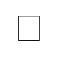
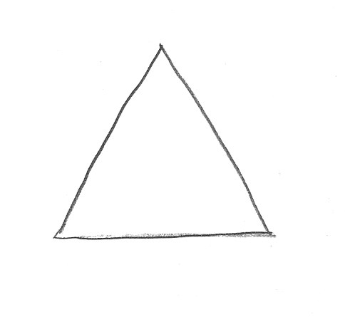

# Example images

## Computer generated, hollow, clean
||
-|-|-
image1.bmp|image2.bmp|image3.bmp

## Computer generated, sloid, clean
|
-|-|-
noisy.bmp|noisy2.bmp

## hand-drawn, hollow, noisy
|
-|-
triangle.bmp|hexagon.bmp

## hand-drawn, solid, noisy
||
-|
diamond.bmp|
